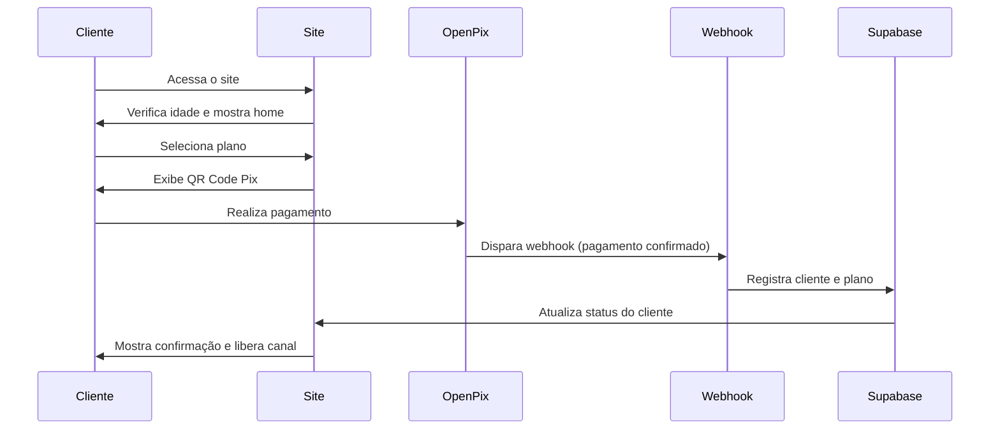

# 🧭 Jornada do Cliente — Projeto Paula Azevedo

## 📊 Diagrama Visual

```mermaid
graph TD
    A[Entrada] --> B[Verificação de Idade]
    B --> C[Home]
    C --> D[Planos]
    D --> E[Processo de Compra]
    E --> F[Pagamento via Pix - OpenPix]
    F --> G[Webhook (Pix Confirmado)]
    G --> H[Confirmação]
    H --> I[Escolha do Canal]
    I --> J[Área do Cliente]
    J --> K[Feed de Conteúdo]
    J --> L[Sistema de Likes]
    J --> M[Perfil]
    J --> N[Histórico]

    style A fill:#E91E63,stroke:#fff,color:#fff
    style B-N fill:#1a1a1a,stroke:#E91E63,color:#fff
```

## 🔎 Etapas Detalhadas

### 1. Verificação de Idade

- **Componente**: `AgeVerification`
- **Função**: Modal obrigatório, com armazenamento do consentimento

### 2. Home

- **Componente**: `Home`
- **Função**: Apresentação e CTA para os planos

### 3. Planos

- **Componente**: `Plans`
- **Função**: Exibição dos planos disponíveis e redirecionamento para checkout Pix

### 4. Processo de Compra

- **Componente**: `PaymentPage`
- **Função**: Exibição do plano, QR Code, botão "já paguei"

### 5. Pagamento via Pix (OpenPix)

- **Componente**: `PixCheckout`
- **Função**: Integração com OpenPix, QR dinâmico, código copia e cola

### 6. Webhook e Validação

- **Componente**: `webhook.ts`
- **Função**: Confirmação do pagamento, validação do status, registro no Supabase

### 7. Confirmação

- **Componente**: `ConfirmacaoPage`
- **Função**: Mensagem de sucesso, chamada para escolha de canal

### 8. Escolha do Canal

- **Componente**: `CanalEntrega`
- **Função**: Registro da preferência (Telegram, WhatsApp ou E-mail)

### 9. Área do Cliente

- **Componentes**: `ClientDashboard`, `ContentFeed`, `Likes`, `Profile`, `History`
- **Função**: Acesso ao conteúdo exclusivo

## 🔁 Fluxo de Dados



## ⚙️ Integrações

- **OpenPix**: Pagamentos com Pix, QR dinâmico, Webhook
- **Supabase**: Auth, Database, API REST
- **Telegram/WhatsApp/Email**: Canais de entrega do conteúdo

## 🔐 Segurança

- Verificação de idade
- Rate limiting e logging
- JWT e proteção de rotas
- Webhook validado

## 📈 Monitoramento

- Logs de acesso e erros
- Métricas de conversão e engajamento
- Alertas de falhas e fraudes
