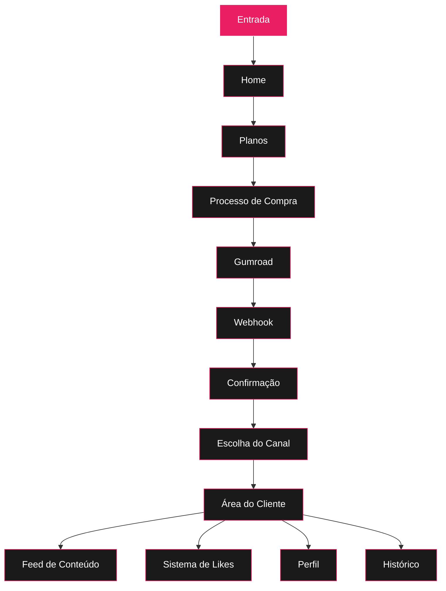
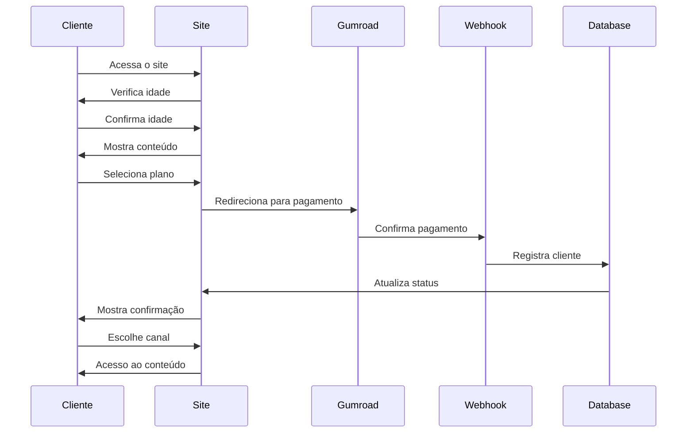

# Jornada do Cliente

## Detalhamento das Etapas

### 1. Home
- **Componente**: `Home`
- **Funcionalidades**:
  - Apresentação do conteúdo
  - Call-to-action para planos
  - Preview do conteúdo

### 2. Planos
- **Componente**: `Plans`
- **Funcionalidades**:
  - Exibição dos planos disponíveis
  - Comparativo de benefícios
  - Botões de ação para compra

### 3. Processo de Compra
- **Componente**: `PaymentPage`
- **Funcionalidades**:
  - Seleção do plano
  - Redirecionamento para Gumroad
  - Processamento do pagamento

### 4. Webhook e Confirmação
- **Componente**: `webhook.ts`
- **Funcionalidades**:
  - Recebimento de notificações
  - Atualização de status
  - Envio de confirmações

### 5. Escolha do Canal
- **Componente**: `PaymentConfirmation`
- **Funcionalidades**:
  - Seleção do canal preferido
  - Configuração de entrega
  - Confirmação de preferências

### 6. Área do Cliente
- **Componente**: `ClientArea`
- **Funcionalidades**:
  - Dashboard personalizado
  - Acesso ao conteúdo
  - Gerenciamento de conta

### 7. Feed de Conteúdo
- **Componente**: `ContentFeed`
- **Funcionalidades**:
  - Exibição de posts
  - Sistema de filtros
  - Paginação

### 8. Sistema de Likes
- **Componente**: `LikeSystem`
- **Funcionalidades**:
  - Interação com posts
  - Contagem de likes
  - Favoritos

### 9. Perfil
- **Componente**: `Profile`
- **Funcionalidades**:
  - Informações do usuário
  - Configurações
  - Preferências

### 10. Histórico
- **Componente**: `History`
- **Funcionalidades**:
  - Registro de atividades
  - Conteúdo visualizado
  - Interações realizadas

## Fluxo de Dados

## Integrações

1. **Supabase**
   - Autenticação
   - Banco de dados
   - Storage

2. **Gumroad**
   - Processamento de pagamentos
   - Webhooks
   - Gestão de produtos

3. **Canais de Entrega**
   - Telegram Bot
   - WhatsApp Business API
   - Email Marketing

## Segurança

1. **Verificação de Idade**
   - Modal obrigatório
   - Armazenamento do consentimento
   - Redirecionamento seguro

2. **Rate Limiting**
   - Limite de requisições
   - Proteção contra abusos
   - Monitoramento de IPs

3. **Autenticação**
   - JWT tokens
   - Sessões seguras
   - Proteção de rotas

## Monitoramento

1. **Logs**
   - Acessos
   - Erros
   - Conversões

2. **Métricas**
   - Taxa de conversão
   - Tempo de sessão
   - Engajamento

3. **Alertas**
   - Erros críticos
   - Tentativas de fraude
   - Problemas de performance 